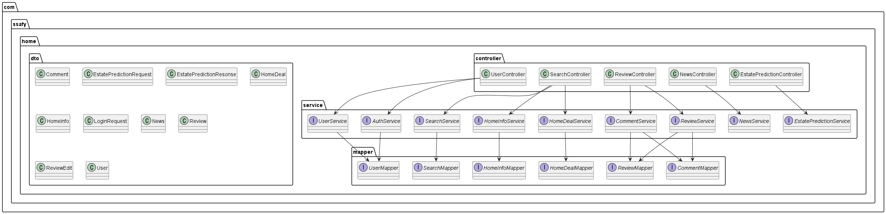
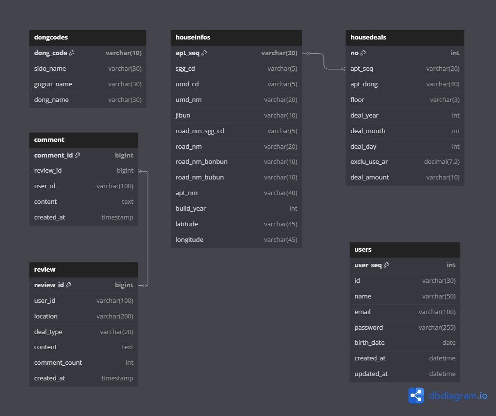

# ProphetHouse 🏠

> AI 기반 부동산 가격 예측 서비스

SSAFY 대전 5반 관통 프로젝트 - 머신러닝을 활용한 스마트 부동산 플랫폼

## 📖 프로젝트 개요

ProphetHouse는 빅데이터와 AI 기술을 활용하여 부동산 가격을 예측하고, 사용자에게 신뢰할 수 있는 부동산 시장 정보를 제공하는 웹 서비스입니다.

## ✨ 주요 기능

- 🤖 **AI 가격 예측**: 머신러닝 모델 기반 부동산 가격 예측
- 📊 **시장 분석**: 지역별 부동산 시장 동향 분석
- 🔍 **매물 검색**: 다양한 조건의 부동산 검색 및 필터링
- 📈 **트렌드 분석**: 시계열 데이터 기반 가격 변동 추이
- 💡 **투자 인사이트**: 데이터 기반 투자 가이드 제공

## 🛠️ 기술 스택

### Frontend
- Vue.js
- JavaScript
- Bootstrap

### Backend  
- Spring Boot
- Java
- MySQL

### AI/Data
- Python
- TensorFlow/Scikit-learn
- Pandas, NumPy

### Tools
- Git/GitLab
- Docker

## 🏗️ 시스템 아키텍처

## 📊 데이터베이스 설계

## 🎬 프로젝트 시연

## 🚀 Quick Start

### 1. 저장소 클론
git clone https://github.com/your-username/ProphetHouse.git
cd ProphetHouse

### 2. 데이터베이스 설정
MySQL 실행 후
mysql -u root -p < database/schema.sql

### 3. 백엔드 실행
cd frontend
npm install
npm start

## 📋 API 문서

### 주요 엔드포인트

| Method | Endpoint | Description |
|--------|----------|-------------|
| GET | `/api/properties` | 부동산 목록 조회 |
| GET | `/api/predict/{id}` | 가격 예측 요청 |
| POST | `/api/analysis` | 시장 분석 데이터 |
| GET | `/api/trends` | 트렌드 데이터 조회 |

## 🎯 핵심 알고리즘

- **예측 모델**: GRU(Gated Recurrent Unit) 기반 시계열 예측
- **데이터 전처리**: 이상치 제거 및 정규화

## 👥 팀원

| 이름 | 역할 | GitHub |
|------|------|--------|
| 유승준 | Backend, Frontend | 
| 어은지 | Backend, AI Model | 

## 📚 관련 문서

- 
- 
- 
- 

## 📱 스크린샷

| 메인 페이지 | 예측 결과 | 시장 분석 |
|-----------|---------|---------|
|  |  |  |

---

⭐ **이 프로젝트가 도움이 되었다면 Star를 눌러주세요!**
